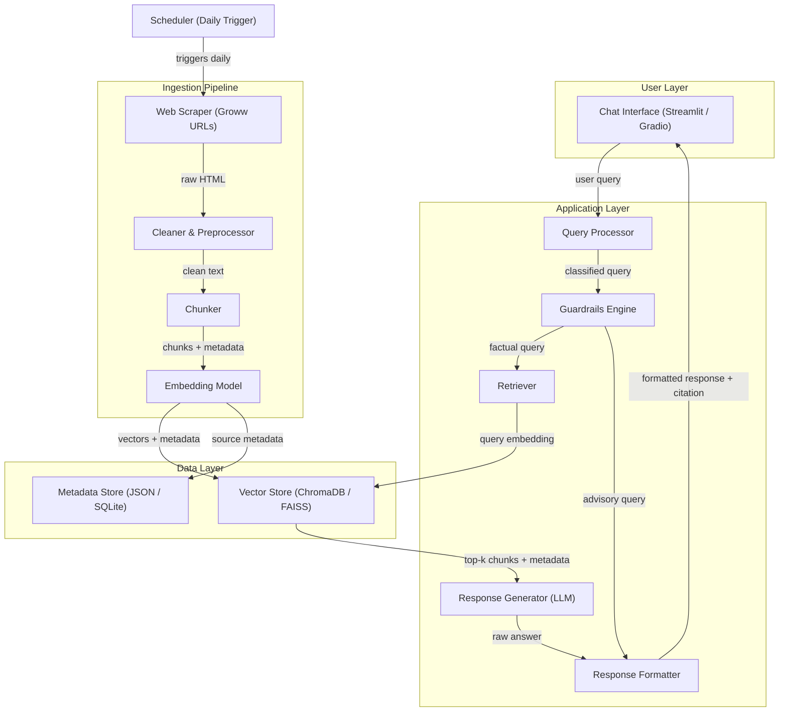
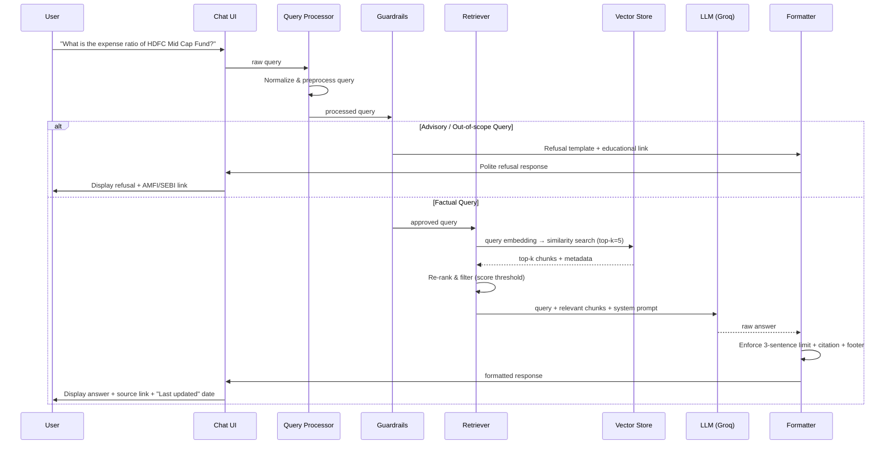
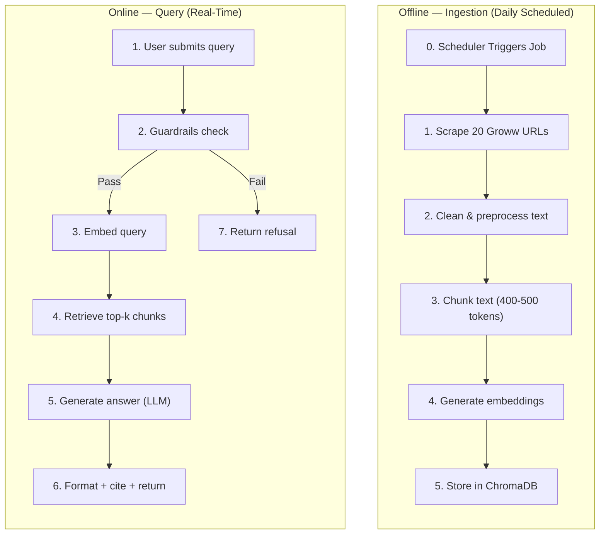
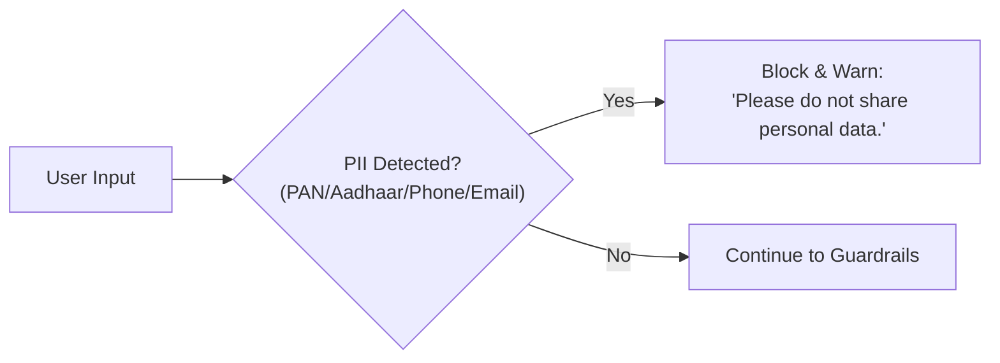

# Architecture: Mutual Fund FAQ Assistant (RAG-Based)

> Reference: [problemStatement.md](file:///Users/bhawna/Desktop/RAG/Docs/problemStatement.md)

---

## 1. System Overview

The Mutual Fund FAQ Assistant is a **Retrieval-Augmented Generation (RAG)** system that answers facts-only queries about 20 mutual fund schemes across 4 AMCs. It retrieves information from a curated vector store built exclusively from the **20 official Groww scheme page URLs**, then generates concise, source-cited responses via an LLM.



---

## 2. Technology Stack

| Layer | Technology | Rationale |
|---|---|---|
| **Language** | Python 3.10+ | Industry standard for ML/NLP pipelines |
| **Web Scraping** | `BeautifulSoup4` + `requests` / `Selenium` | Static & dynamic page scraping from Groww |
| **Text Chunking** | `LangChain` `RecursiveCharacterTextSplitter` | Semantically aware chunking with overlap |
| **Embeddings** | `BAAI/bge-small-en-v1.5` (via `sentence-transformers`) | High-quality, lightweight BGE embeddings |
| **Vector Store** | `ChromaDB` (local) / `FAISS` | Lightweight, no external infra needed |
| **LLM** | `Groq` (Llama 3.1 70B / Mixtral) | Fast inference, free tier available |
| **Orchestration** | `LangChain` / `LlamaIndex` | RAG pipeline orchestration |
| **Frontend** | `Streamlit` / `Gradio` | Rapid prototyping for chat UI |
| **API Layer** | `FastAPI` (optional) | REST API for decoupled frontend |
| **Config Management** | `python-dotenv` + `pydantic-settings` | Secure API key and config handling |

---

## 3. Architecture Components (Detailed)

### 3.1 Data Ingestion Pipeline

The ingestion pipeline is a **batch offline process** that is triggered daily by the Scheduler Component to ensure the vector store always has the latest NAV, AUM, and scheme data.

```mermaid
flowchart LR
    SCHED["Scheduler"] -->|Daily Trigger| A["20 Groww URLs"]
    A --> B["Web Scraper\n(requests + BS4)"]
    B --> C["Raw HTML"]
    C --> D["Cleaner &\nPreprocessor"]
    D --> E["Clean Text\n+ Metadata"]
    E --> F["Chunker\n(RecursiveCharacterTextSplitter)"]
    F --> G["Text Chunks\n(~300-500 tokens each)"]
    G --> H["Embedding Model"]
    H --> I["Vector Store\n(ChromaDB)"]
```



#### 3.1.1 Web Scraping Module

**Purpose:** Extract structured data from the 20 confirmed Groww scheme URLs.

**Approach:**
- Use `requests` + `BeautifulSoup4` for static HTML pages
- Use `Selenium` / `Playwright` as fallback if Groww pages render content dynamically via JavaScript
- Extract key fields per scheme page:

| Field | Source Location (Groww Page) |
|---|---|
| Scheme Name | Page title / hero section |
| NAV | Current NAV section |
| Expense Ratio | Fund details table |
| Exit Load | Fund details table |
| Minimum SIP Amount | Investment details section |
| Minimum Lumpsum | Investment details section |
| Riskometer Category | Risk indicator section |
| Benchmark Index | Fund details table |
| Fund Manager | Fund manager section |
| Category / Sub-category | Breadcrumb / fund type label |
| Lock-in Period | Fund details (ELSS schemes) |
| AUM | Fund overview |

**Output:** Raw scraped data stored as JSON files per scheme in `data/raw/`.

#### 3.1.2 Document Cleaning & Preprocessing

**Purpose:** Normalize and clean raw scraped content for consistent downstream processing.

**Steps:**
1. Strip HTML tags, ads, navigation, and boilerplate
2. Normalize whitespace, fix encoding issues
3. Remove duplicate content blocks
4. Standardize numerical formats (₹, %, dates)
5. Attach metadata to each cleaned document:
   ```json
   {
     "source_url": "https://groww.in/mutual-funds/...",
     "scheme_name": "HDFC Mid Cap Fund – Direct Growth",
     "amc": "HDFC Mutual Fund",
     "category": "Mid Cap",
     "scrape_date": "2026-07-13",
     "source_type": "groww_scheme_page"
   }
   ```

**Output:** Cleaned text files stored in `data/processed/`.

#### 3.1.3 Text Chunking

**Purpose:** Split cleaned documents into retrieval-friendly chunks while preserving context.

**Strategy:**
- **Chunking Method:** `RecursiveCharacterTextSplitter` (LangChain)
- **Chunk Size:** 400–500 tokens
- **Chunk Overlap:** 50–75 tokens (for context continuity)
- **Separators:** `["\n\n", "\n", ". ", " "]` (in priority order)
- Each chunk inherits its parent document's metadata + a `chunk_id`

**Output:** List of `Document` objects with `page_content` + `metadata`.

#### 3.1.4 Embedding & Indexing

**Purpose:** Convert text chunks into vector embeddings and store in the vector database.

**Embedding Model: BGE (BAAI General Embedding)**

| Model | Dimensions | Speed | Quality |
|---|---|---|---|
| `BAAI/bge-small-en-v1.5` | 384 | ⚡ Fast | Good — **recommended for this project** |
| `BAAI/bge-base-en-v1.5` | 768 | Medium | Better |
| `BAAI/bge-large-en-v1.5` | 1024 | Slower | Best |

**Vector Store:**
- **Primary Choice:** `ChromaDB` — persistent local storage, metadata filtering, simple setup
- **Alternative:** `FAISS` — faster similarity search, but no built-in metadata filtering

**Index Schema:**
```
Collection: mutual_fund_faq
├── id: unique chunk ID
├── embedding: float vector
├── document: chunk text content
└── metadata:
    ├── source_url: string
    ├── scheme_name: string
    ├── amc: string
    ├── category: string
    ├── source_type: string
    └── scrape_date: string
```

---

### 3.2 Query Processing Pipeline

This is the **real-time pipeline** that handles every user query.



#### 3.2.1 Query Processor

**Responsibilities:**
- Normalize user input (lowercase, strip extra whitespace)
- Basic spell correction for scheme names (optional, using fuzzy matching)
- Extract intent signals (scheme name, metric type)

#### 3.2.2 Guardrails Engine

**Purpose:** Classify queries as factual vs. advisory/out-of-scope and enforce compliance.

**Classification Approach:**

| Method | Description |
|---|---|
| **Keyword-based rules** | Detect advisory keywords: *"should I"*, *"which is better"*, *"recommend"*, *"suggest"*, *"good fund"* |
| **LLM-based classification** | Lightweight prompt to classify query intent as `FACTUAL`, `ADVISORY`, or `OUT_OF_SCOPE` |
| **Hybrid (Recommended)** | Keyword pre-filter + LLM confirmation for ambiguous cases |

**Refusal Response Template:**
```
I'm designed to provide only factual information about mutual fund schemes. 
I cannot offer investment advice or comparisons.

For investment guidance, please consult a SEBI-registered advisor or visit: 
https://www.amfiindia.com/investor-corner/knowledge-center
```

**Privacy Guardrail:**
- Regex-based detection of PAN (`[A-Z]{5}[0-9]{4}[A-Z]`), Aadhaar (`\d{4}\s?\d{4}\s?\d{4}`), phone numbers, and email addresses
- If detected → immediate refusal with privacy message

#### 3.2.3 Retriever

**Purpose:** Find the most relevant chunks from the vector store for a given query.

**Retrieval Strategy:**

| Parameter | Value | Rationale |
|---|---|---|
| **Top-k** | 5 | Balance between context richness and noise |
| **Similarity Metric** | Cosine Similarity | Standard for sentence embeddings |
| **Score Threshold** | 0.65 | Filter out low-relevance chunks |
| **Metadata Filter** | Optional (by AMC, scheme name) | Narrow search when scheme is identified in query |

**Re-ranking (Optional Enhancement):**
- Use a cross-encoder (`cross-encoder/ms-marco-MiniLM-L-6-v2`) to re-rank top-k results for improved precision

#### 3.2.4 Response Generator (LLM)

**Purpose:** Generate a concise, factual answer grounded in retrieved chunks.

**System Prompt:**
```
You are a facts-only mutual fund FAQ assistant for schemes available on Groww.

RULES:
1. Answer ONLY using the provided context. Do not use external knowledge.
2. Keep your response to a MAXIMUM of 3 sentences.
3. Include exactly ONE source citation URL from the context metadata.
4. If the context does not contain the answer, say: "I don't have this information in my current sources."
5. NEVER provide investment advice, opinions, or comparisons.
6. NEVER discuss fund performance, returns, or future predictions.
7. End every response with: "Last updated from sources: <scrape_date>"
```

**LLM Configuration:**

| Parameter | Value |
|---|---|
| Temperature | 0.0 (deterministic) |
| Max Tokens | 200 |
| Model | `llama-3.1-70b-versatile` (Groq) |

#### 3.2.5 Response Formatter

**Purpose:** Enforce output compliance before displaying to the user.

**Post-processing checks:**
1. ✅ Sentence count ≤ 3
2. ✅ Exactly 1 citation URL present
3. ✅ Footer with `"Last updated from sources: <date>"` appended
4. ✅ No advisory language detected (double-check)
5. ✅ No PII in response

**Output Format:**
```
<answer text — max 3 sentences>

Source: <source_url>
Last updated from sources: 2026-07-13
```

---

### 3.3 Frontend (Chat UI)

**Technology:** Streamlit (primary) or Gradio (alternative)

**UI Components:**

| Component | Description |
|---|---|
| **Header** | App title: *"Mutual Fund FAQ Assistant"* |
| **Disclaimer Banner** | Persistent: *"Facts-only. No investment advice."* |
| **Welcome Message** | Greeting + brief explanation of capabilities |
| **Example Questions** | 3 clickable example queries (pre-filled on click) |
| **Chat Input** | Text input for user queries |
| **Chat History** | Scrollable conversation thread |
| **Source Citation** | Clickable link below each response |
| **Footer** | Last updated date + disclaimer |

**Example Questions:**
1. *"What is the expense ratio of Parag Parikh Flexi Cap Fund?"*
2. *"What is the exit load for HDFC Mid Cap Fund?"*
3. *"What is the minimum SIP amount for ICICI Prudential Technology Fund?"*

---

### 3.4 Scheduler Component

**Purpose:** Automate the daily execution of the data ingestion pipeline to keep NAV, AUM, and expense ratio data fresh.

**Technology:** `APScheduler` (Advanced Python Scheduler) or system Cron job.

**Schedule:** Daily at 10:30 AM IST.

**Workflow:**
1. Triggers the `run_ingestion.py` script.
2. Scrapes the 20 Groww URLs.
3. Cleans and chunks the new data.
4. Generates embeddings and updates the ChromaDB collection.
5. Logs the ingestion status (success/failure) for monitoring.

---

## 4. Data Flow Summary



---

## 5. Project Directory Structure

```
RAG/
├── Docs/
│   ├── ProblemStatement.txt          # Original problem statement (raw)
│   ├── problemStatement.md           # Formatted problem statement
│   └── Architecture.md               # This document
│
├── data/
│   ├── raw/                          # Raw scraped HTML/JSON per scheme
│   ├── processed/                    # Cleaned text documents
│   └── vectorstore/                  # ChromaDB persistent storage
│
├── src/
│   ├── ingestion/
│   │   ├── scraper.py                # Web scraping logic (20 Groww URLs)
│   │   ├── cleaner.py                # Text cleaning & preprocessing
│   │   ├── chunker.py                # Text chunking with metadata
│   │   └── embedder.py               # Embedding generation & vector store indexing
│   │
│   ├── pipeline/
│   │   ├── query_processor.py        # Query normalization & preprocessing
│   │   ├── guardrails.py             # Query classification & refusal logic
│   │   ├── retriever.py              # Vector search & re-ranking
│   │   ├── generator.py              # LLM response generation
│   │   └── formatter.py              # Response formatting & compliance
│   │
│   ├── config/
│   │   ├── settings.py               # App configuration (pydantic-settings)
│   │   ├── prompts.py                # System prompts & templates
│   │   └── constants.py              # URL lists, scheme metadata, thresholds
│   │
│   └── utils/
│       ├── logger.py                 # Logging utility
│       └── helpers.py                # Shared helper functions
│
├── app/
│   └── streamlit_app.py              # Streamlit chat UI
│
├── scripts/
│   ├── run_ingestion.py              # One-click ingestion pipeline
│   └── run_evaluation.py             # Evaluation script (accuracy testing)
│
├── tests/
│   ├── test_guardrails.py            # Unit tests for guardrails
│   ├── test_retriever.py             # Unit tests for retrieval
│   └── test_formatter.py             # Unit tests for response formatting
│
├── .env.example                      # Template for environment variables
├── requirements.txt                  # Python dependencies
├── README.md                         # Project README
└── .gitignore
```

---

## 6. Security & Compliance

### 6.1 PII Detection & Blocking



**Regex Patterns:**

| PII Type | Pattern |
|---|---|
| PAN | `[A-Z]{5}[0-9]{4}[A-Z]` |
| Aadhaar | `\b\d{4}[\s-]?\d{4}[\s-]?\d{4}\b` |
| Phone | `\b[6-9]\d{9}\b` |
| Email | `[\w.-]+@[\w.-]+\.\w+` |

### 6.2 Content Safety Guardrails

| Rule | Implementation |
|---|---|
| No investment advice | Keyword filter + LLM system prompt |
| No performance comparisons | Blocked at guardrails layer |
| No return calculations | Blocked at guardrails layer |
| Source-only answers | LLM grounded to retrieved context only |
| Hallucination mitigation | Temperature=0.0, strict system prompt |

---

## 7. Evaluation Strategy

### 7.1 Retrieval Quality

| Metric | Target | How |
|---|---|---|
| **Precision@5** | ≥ 0.8 | Are the top-5 retrieved chunks relevant? |
| **Recall@5** | ≥ 0.7 | Does top-5 cover the ground truth? |
| **MRR** (Mean Reciprocal Rank) | ≥ 0.75 | Is the correct chunk ranked highly? |

### 7.2 Generation Quality

| Metric | Target | How |
|---|---|---|
| **Factual Accuracy** | ≥ 95% | Manual review against source pages |
| **Citation Accuracy** | 100% | Every response must have a valid source URL |
| **Response Length** | ≤ 3 sentences | Automated check |
| **Refusal Accuracy** | ≥ 95% | Advisory queries correctly refused |

### 7.3 Test Query Set

Create a benchmark of **30–50 test queries** across these categories:

| Category | Examples | Expected Behavior |
|---|---|---|
| Direct factual | *"Expense ratio of HDFC Mid Cap Fund?"* | Answer + citation |
| Cross-scheme factual | *"Lock-in period for Parag Parikh ELSS Fund?"* | Answer + citation |
| Process/How-to | *"How to download capital gains report?"* | Answer + citation |
| Advisory (refusal) | *"Should I invest in ICICI Large Cap?"* | Polite refusal |
| Comparison (refusal) | *"Which is better — HDFC or ICICI Large Cap?"* | Polite refusal |
| Out-of-scope | *"What's the weather today?"* | Polite refusal |
| PII-containing | *"My PAN is ABCDE1234F, check my folio"* | PII block |

---

## 8. Deployment Options

| Option | Details | Best For |
|---|---|---|
| **Local** | `streamlit run app/streamlit_app.py` | Development & testing |
| **Streamlit Cloud** | Deploy via GitHub integration | Quick public demo |
| **Hugging Face Spaces** | Gradio/Streamlit on HF infra | Portfolio showcase |
| **Docker** | Containerized with `Dockerfile` | Reproducible deployment |
| **Cloud VM** (AWS/GCP) | Full control, FastAPI + Streamlit | Production-like setup |

---

## 9. Known Limitations & Future Improvements

### Current Limitations
- Data is **static** — scraped at a point in time; NAV and AUM values will go stale
- Limited to **20 schemes across 4 AMCs** — not a comprehensive mutual fund database
- No **multi-turn conversation** memory — each query is independent
- Groww page structure changes may **break the scraper**

### Future Improvements

| Improvement | Description | Priority |
|---|---|---|
| **Conversation memory** | Multi-turn context for follow-up questions | Medium |
| **Expand corpus** | Add more AMCs, more schemes, additional source types (KIM, SID, factsheet PDFs) | Medium |
| **Advanced re-ranking** | Cross-encoder re-ranking for better retrieval | Low |
| **Analytics dashboard** | Track query patterns, refusal rates, popular schemes | Low |
| **Feedback loop** | Thumbs up/down on responses to improve quality | Low |

---

> **Disclaimer:** *Facts-only. No investment advice.*
