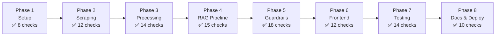

# Evaluation Criteria: Phase-Wise Validation

> Reference: [ImplementationPlan.md](file:///Users/bhawna/Desktop/RAG/Docs/ImplementationPlan.md) | [Architecture.md](file:///Users/bhawna/Desktop/RAG/Docs/Architecture.md) | [EdgeCases.md](file:///Users/bhawna/Desktop/RAG/Docs/EdgeCases.md)

This document defines **acceptance criteria**, **test cases**, and **verification methods** for each phase of the implementation plan. A phase is considered complete only when all its evaluation criteria are met.

---

## Evaluation Summary



| Phase | Total Checks | Gate Condition |
|---|---|---|
| 1 | 8 | All 8 must pass |
| 2 | 12 | All 12 must pass |
| 3 | 14 | All 14 must pass |
| 4 | 15 | ≥ 13 must pass (2 optional marked with ⭐) |
| 5 | 18 | All 18 must pass |
| 6 | 12 | ≥ 10 must pass (2 optional marked with ⭐) |
| 7 | 14 | All 14 must pass |
| 8 | 10 | All 10 must pass |

**Legend:**
- ✅ = Required for phase completion
- ⭐ = Optional / nice-to-have enhancement

---

## Phase 1: Project Setup & Configuration

> **Goal:** Verify that the project skeleton is correctly set up, dependencies install without errors, and configuration is properly loaded.

### Acceptance Criteria

| # | Check | Type | How to Verify | Pass Condition |
|---|---|---|---|---|
| 1.1 | Directory structure exists | ✅ | `find RAG/src RAG/data RAG/app RAG/scripts RAG/tests -type d` | All directories from Architecture.md exist |
| 1.2 | `__init__.py` files present | ✅ | `find RAG/src -name "__init__.py"` | Present in `ingestion/`, `pipeline/`, `config/`, `utils/` |
| 1.3 | Dependencies install cleanly | ✅ | `pip install -r requirements.txt` | Exit code 0, no conflicts |
| 1.4 | `.env.example` has all keys | ✅ | Manual review | Contains: `GROQ_API_KEY`, `EMBEDDING_MODEL`, `LLM_MODEL`, `LLM_TEMPERATURE`, `LLM_MAX_TOKENS`, `TOP_K`, `SCORE_THRESHOLD`, `CHROMA_PERSIST_DIR`, `CHROMA_COLLECTION` |
| 1.5 | `.env` loads correctly | ✅ | `python -c "from src.config.settings import Settings; s = Settings(); print(s.GROQ_API_KEY[:5])"` | No import errors, key partially printed |
| 1.6 | `constants.py` has 20 URLs | ✅ | `python -c "from src.config.constants import GROWW_URLS; print(len(GROWW_URLS))"` | Output: `20` |
| 1.7 | `.gitignore` excludes sensitive files | ✅ | `cat .gitignore` | Contains: `.env`, `data/`, `__pycache__/`, `*.pyc` |
| 1.8 | Logger outputs correctly | ✅ | `python -c "from src.utils.logger import logger; logger.info('test')"` | Log message printed to console with timestamp |

### Verification Script

```bash
# Phase 1 — Quick validation
echo "=== Phase 1 Eval ==="
echo "1.1 Directories..."
ls -d data/raw data/processed data/vectorstore src/ingestion src/pipeline src/config src/utils app scripts tests

echo "1.2 Init files..."
ls src/ingestion/__init__.py src/pipeline/__init__.py src/config/__init__.py src/utils/__init__.py

echo "1.3 Dependencies..."
pip install -r requirements.txt --quiet && echo "PASS" || echo "FAIL"

echo "1.6 URL count..."
python -c "from src.config.constants import GROWW_URLS; assert len(GROWW_URLS) == 20; print('PASS: 20 URLs')"

echo "1.5 Settings..."
python -c "from src.config.settings import Settings; Settings(); print('PASS: Settings loaded')"
```

---

## Phase 2: Web Scraping Pipeline

> **Goal:** Verify that all 20 Groww URLs are scraped successfully with complete, accurate data.

### Acceptance Criteria

| # | Check | Type | How to Verify | Pass Condition |
|---|---|---|---|---|
| 2.1 | All 20 URLs scraped | ✅ | `ls data/raw/ \| wc -l` | 20 JSON files in `data/raw/` |
| 2.2 | No empty JSON files | ✅ | `find data/raw -empty` | No results (all files have content) |
| 2.3 | Scheme name extracted | ✅ | `jq '.scheme_name' data/raw/*.json` | All 20 return non-null, non-empty strings |
| 2.4 | Source URL stored | ✅ | `jq '.source_url' data/raw/*.json` | All 20 return valid Groww URLs |
| 2.5 | Scrape date present | ✅ | `jq '.scrape_date' data/raw/*.json` | All 20 return today's date in `YYYY-MM-DD` |
| 2.6 | AMC name extracted | ✅ | `jq '.amc' data/raw/*.json` | Returns one of: PPFAS, HDFC, ICICI Prudential, Motilal Oswal |
| 2.7 | Category extracted | ✅ | `jq '.category' data/raw/*.json` | Non-null for all 20 |
| 2.8 | `full_page_text` is non-empty | ✅ | `jq '.full_page_text \| length' data/raw/*.json` | All return > 100 characters |
| 2.9 | Structured fields extracted | ✅ | Spot-check 5 files | At least `expense_ratio`, `exit_load`, `min_sip` present in `structured_data` |
| 2.10 | No HTTP errors logged | ✅ | `grep -i "error\|failed\|403\|429\|500" logs/scraping.log` | No critical errors (warnings acceptable) |
| 2.11 | Rate limiting respected | ✅ | Review scraper logs for timestamps | ≥ 1 second gap between consecutive requests |
| 2.12 | Idempotent re-run | ✅ | Run scraper twice | Second run overwrites cleanly, no duplicates or crashes |

### Spot-Check Template

Manually verify **5 schemes** against live Groww pages:

| Scheme | Expense Ratio (Groww) | Expense Ratio (Scraped) | Match? |
|---|---|---|---|
| HDFC Mid Cap Fund | _____% | _____% | ☐ |
| Parag Parikh ELSS Fund | _____% | _____% | ☐ |
| ICICI Prudential Technology Fund | _____% | _____% | ☐ |
| Motilal Oswal Small Cap Fund | _____% | _____% | ☐ |
| HDFC Nifty 50 Index Fund | _____% | _____% | ☐ |

> **Pass:** All 5 match (or differ by < 0.05% due to daily updates)

---

## Phase 3: Data Processing & Vector Store Indexing

> **Goal:** Verify cleaned data quality, chunk integrity, embedding correctness, and ChromaDB population.

### 3A — Cleaning Evaluation

| # | Check | Type | How to Verify | Pass Condition |
|---|---|---|---|---|
| 3.1 | All 20 cleaned files produced | ✅ | `ls data/processed/ \| wc -l` | 20 files |
| 3.2 | No HTML tags in cleaned text | ✅ | `grep -rn '<[a-z]' data/processed/` | No results |
| 3.3 | No boilerplate text | ✅ | `grep -ri "download.*app\|cookie.*policy\|sign.*up" data/processed/` | No results |
| 3.4 | `₹` symbol preserved | ✅ | `grep '₹' data/processed/*.json \| head -3` | ₹ symbol intact, not garbled |
| 3.5 | Metadata complete | ✅ | `jq '.source_url, .scheme_name, .amc, .category, .scrape_date' data/processed/*.json` | All 5 fields non-null for all 20 |

### 3B — Chunking Evaluation

| # | Check | Type | How to Verify | Pass Condition |
|---|---|---|---|---|
| 3.6 | Total chunks > 0 | ✅ | Log output from chunker | At least 1 chunk per scheme (20+ total) |
| 3.7 | Chunk size within range | ✅ | `python -c "..."` (see script below) | All chunks: 50 < len < 600 characters |
| 3.8 | No empty chunks | ✅ | Filter chunks where `len(page_content.strip()) == 0` | Count = 0 |
| 3.9 | Metadata attached to every chunk | ✅ | Check `chunk.metadata` for all chunks | Every chunk has `source_url`, `scheme_name`, `amc`, `category`, `scrape_date`, `chunk_id` |
| 3.10 | Chunk IDs are unique | ✅ | `len(set(chunk_ids)) == len(chunk_ids)` | True |

### 3C — Embedding & ChromaDB Evaluation

| # | Check | Type | How to Verify | Pass Condition |
|---|---|---|---|---|
| 3.11 | ChromaDB collection exists | ✅ | `python -c "import chromadb; c = chromadb.PersistentClient('./data/vectorstore'); print(c.list_collections())"` | `mutual_fund_faq` collection present |
| 3.12 | Collection count matches chunks | ✅ | `collection.count()` | Equals total chunks from 3.6 |
| 3.13 | Sample similarity query works | ✅ | Query: "expense ratio" → returns results | Returns ≥ 1 result with score > 0 |
| 3.14 | Metadata retrievable from results | ✅ | Check `results['metadatas']` | `source_url`, `scheme_name` present in metadata |

### Verification Script

```python
# Phase 3 — Chunking & Embedding Validation
import chromadb

client = chromadb.PersistentClient("./data/vectorstore")
collection = client.get_collection("mutual_fund_faq")

# 3.12 — Collection count
count = collection.count()
print(f"3.12 Collection count: {count}")
assert count > 0, "FAIL: Collection is empty"

# 3.13 — Sample query
results = collection.query(
    query_texts=["What is the expense ratio?"],
    n_results=3,
)
print(f"3.13 Top result: {results['documents'][0][0][:80]}...")
assert len(results['documents'][0]) > 0, "FAIL: No results returned"

# 3.14 — Metadata check
meta = results['metadatas'][0][0]
assert 'source_url' in meta, "FAIL: source_url missing"
assert 'scheme_name' in meta, "FAIL: scheme_name missing"
print(f"3.14 Source: {meta['source_url']}")
print("All Phase 3 checks PASSED ✅")
```

---

## Phase 4: RAG Query Pipeline

> **Goal:** Verify end-to-end query → retrieve → generate flow produces accurate, cited responses.

### Acceptance Criteria

| # | Check | Type | How to Verify | Pass Condition |
|---|---|---|---|---|
| 4.1 | `preprocess_query()` normalizes input | ✅ | Unit test | `"  What IS the NAV? "` → `"what is the nav?"` |
| 4.2 | `retrieve()` returns top-k chunks | ✅ | Call with sample query | Returns list of ≤ 5 `Document` objects |
| 4.3 | Retrieved chunks are relevant | ✅ | Manual review of top-3 for 5 queries | ≥ 4/5 queries return chunks about the correct scheme |
| 4.4 | Score threshold filters low results | ✅ | Query with out-of-corpus topic (*"stock price of TCS"*) | Returns empty list or chunks below 0.65 are excluded |
| 4.5 | Metadata filter works | ✅ | `retrieve("expense ratio", filters={"amc": "HDFC Mutual Fund"})` | Only HDFC chunks returned |
| 4.6 | `generate_answer()` calls Groq API | ✅ | Call with sample chunks | Returns a non-empty string response |
| 4.7 | Response uses context only | ✅ | Provide chunks about HDFC, ask about HDFC | Response references HDFC data, not fabricated info |
| 4.8 | Response is ≤ 3 sentences | ✅ | Sentence count on 10 sample queries | All 10 pass (≤ 3 sentences) |
| 4.9 | Response includes source URL | ✅ | Check for URL in response | URL present and matches a known Groww URL |
| 4.10 | Response includes "Last updated" footer | ✅ | Check for footer text | `"Last updated from sources: YYYY-MM-DD"` present |
| 4.11 | `ask()` works end-to-end | ✅ | Call `ask("What is the expense ratio of HDFC Mid Cap Fund?")` | Returns dict with `answer`, `source_url`, `scrape_date` |
| 4.12 | No context → graceful fallback | ✅ | Query with no relevant chunks | Returns: *"I don't have this information in my current sources."* |
| 4.13 | Groq timeout handled | ✅ | Simulate timeout (set timeout=0.001s) | Returns graceful error message, no crash |
| 4.14 | ⭐ Fuzzy scheme name matching | ⭐ | Query with misspelled name: *"HDFC Mid Caap Fund"* | Corrects to "HDFC Mid Cap Fund" or still retrieves correct chunks |
| 4.15 | ⭐ Cross-encoder re-ranking | ⭐ | Compare retrieval quality with/without re-ranking | Improved Precision@5 (optional enhancement) |

### Test Query Matrix (10 Queries)

| # | Query | Expected Scheme | Expected Field | Expected Behavior |
|---|---|---|---|---|
| Q1 | *"What is the expense ratio of HDFC Mid Cap Fund?"* | HDFC Mid Cap | Expense Ratio | Factual answer + citation |
| Q2 | *"Exit load for Parag Parikh Flexi Cap Fund"* | PP Long Term Value | Exit Load | Factual answer + citation |
| Q3 | *"Minimum SIP amount for ICICI Prudential Technology Fund"* | ICICI Technology | Min SIP | Factual answer + citation |
| Q4 | *"What is the benchmark index for HDFC Nifty 50 Index Fund?"* | HDFC Nifty 50 | Benchmark | Factual answer + citation |
| Q5 | *"Lock-in period for Parag Parikh ELSS Fund?"* | PP ELSS | Lock-in | Factual answer (3 years) + citation |
| Q6 | *"Riskometer category of Motilal Oswal Small Cap Fund"* | MO Small Cap | Riskometer | Factual answer + citation |
| Q7 | *"Fund manager of HDFC Equity Fund"* | HDFC Equity | Fund Manager | Factual answer + citation |
| Q8 | *"AUM of ICICI Prudential Large Cap Fund"* | ICICI Large Cap | AUM | Factual answer + citation |
| Q9 | *"What is the expense ratio of SBI Bluechip Fund?"* | — (not in corpus) | — | "I don't have this information..." |
| Q10 | *"What is mutual fund?"* | — (generic) | — | General answer or "I don't have this..." |

**Pass Condition:** ≥ 8/10 queries return correct, relevant responses.

---

## Phase 5: Guardrails & Compliance

> **Goal:** Verify PII detection, advisory refusal, content restrictions, and output compliance are watertight.

### 5A — PII Detection Tests

| # | Input | Expected Result | Pass? |
|---|---|---|---|
| 5.1 | *"My PAN is ABCDE1234F"* | `PII_DETECTED` → PII refusal message | ☐ |
| 5.2 | *"Aadhaar number 1234 5678 9012"* | `PII_DETECTED` → PII refusal message | ☐ |
| 5.3 | *"Call me at 9876543210"* | `PII_DETECTED` → PII refusal message | ☐ |
| 5.4 | *"Email me at user@example.com"* | `PII_DETECTED` → PII refusal message | ☐ |
| 5.5 | *"My account number is 123456789012"* | `PII_DETECTED` → PII refusal message | ☐ |
| 5.6 | *"My friend Aadhaar told me about this fund"* | `FACTUAL` (NOT PII — word "Aadhaar" without 12-digit pattern) | ☐ |
| 5.7 | *"ISIN INF879O01027"* | `FACTUAL` (NOT PII — looks like PAN but is a valid ISIN) | ☐ |

**Pass Condition:** 5.1–5.5 correctly blocked; 5.6–5.7 correctly allowed (no false positives).

### 5B — Advisory Refusal Tests

| # | Input | Expected Result | Pass? |
|---|---|---|---|
| 5.8 | *"Should I invest in HDFC Mid Cap Fund?"* | `ADVISORY` → refusal | ☐ |
| 5.9 | *"Which is better — HDFC or ICICI Large Cap?"* | `ADVISORY` → refusal | ☐ |
| 5.10 | *"Recommend a good mutual fund"* | `ADVISORY` → refusal | ☐ |
| 5.11 | *"Is HDFC Mid Cap Fund good for long-term?"* | `ADVISORY` → refusal | ☐ |
| 5.12 | *"What are the 3-year returns?"* | `CONTENT_RESTRICTED` → refusal with factsheet link | ☐ |
| 5.13 | *"Will NAV increase next month?"* | `OUT_OF_SCOPE` → refusal | ☐ |

### 5C — Pass-Through Tests (Should NOT Be Refused)

| # | Input | Expected Result | Pass? |
|---|---|---|---|
| 5.14 | *"What is the expense ratio of HDFC Mid Cap Fund?"* | `FACTUAL` → answer | ☐ |
| 5.15 | *"What is an exit load?"* | `FACTUAL` → answer | ☐ |
| 5.16 | *"Minimum SIP for Parag Parikh ELSS"* | `FACTUAL` → answer | ☐ |

### 5D — Response Formatter Tests

| # | Check | Input to Formatter | Pass Condition |
|---|---|---|---|
| 5.17 | Sentence limit enforced | 5-sentence LLM output | Truncated to 3 sentences |
| 5.18 | Citation injected if missing | LLM output without URL | Source URL from metadata appended |

**Overall Pass Condition:** All 18 checks pass. Zero false negatives on PII/advisory (critical compliance).

---

## Phase 6: Frontend (Streamlit Chat UI)

> **Goal:** Verify the UI is functional, displays correctly, and integrates with the RAG pipeline.

### Acceptance Criteria

| # | Check | Type | How to Verify | Pass Condition |
|---|---|---|---|---|
| 6.1 | App starts without errors | ✅ | `streamlit run app/streamlit_app.py` | Browser opens, no Python tracebacks |
| 6.2 | Title displayed | ✅ | Visual check | "Mutual Fund FAQ Assistant" visible |
| 6.3 | Disclaimer banner visible | ✅ | Visual check | "Facts-only. No investment advice." visible and persistent |
| 6.4 | Welcome message shown | ✅ | Visual check (first load) | Greeting text with capability description |
| 6.5 | 3 example questions displayed | ✅ | Visual check | 3 clickable example queries shown |
| 6.6 | Example question click works | ✅ | Click example → query triggers | Clicking example populates input and submits |
| 6.7 | User query submits | ✅ | Type + Enter | Query appears in chat as user message |
| 6.8 | Assistant response displays | ✅ | Submit factual query | Response appears with answer + source + footer |
| 6.9 | Source link is clickable | ✅ | Click source URL in response | Opens correct Groww page in new tab |
| 6.10 | Chat history persists across queries | ✅ | Submit 3 queries sequentially | All 3 Q&A pairs visible in history |
| 6.11 | ⭐ Loading spinner during processing | ⭐ | Submit query, observe UI | Spinner or "Thinking..." shown while processing |
| 6.12 | ⭐ Refusal responses display correctly | ⭐ | Submit advisory query | Refusal message displays cleanly with educational link |

### UI Walkthrough Test

Perform this **manual walkthrough** end-to-end:

```
Step 1: Launch app → verify title, disclaimer, welcome message, examples
Step 2: Click example question #1 → verify response appears
Step 3: Type factual query → verify correct answer with citation
Step 4: Type advisory query → verify polite refusal
Step 5: Type PII query → verify PII block message
Step 6: Type out-of-corpus query → verify "don't have info" response
Step 7: Verify all 6 interactions in chat history
Step 8: Refresh page → verify session resets cleanly
```

**Pass Condition:** All 8 walkthrough steps complete without errors.

---

## Phase 7: Testing & Evaluation

> **Goal:** Run systematic benchmarks and validate that quality metrics meet defined targets.

### 7A — Retrieval Quality Metrics

| # | Metric | Target | How to Measure | Pass? |
|---|---|---|---|---|
| 7.1 | **Precision@5** | ≥ 0.80 | For each test query, are the top-5 chunks relevant? `(relevant chunks in top-5) / 5` | ☐ |
| 7.2 | **Recall@5** | ≥ 0.70 | Does top-5 contain the ground-truth chunk? `(ground-truth found) / (total ground-truth)` | ☐ |
| 7.3 | **MRR** (Mean Reciprocal Rank) | ≥ 0.75 | Average of `1/rank` for the first relevant chunk | ☐ |
| 7.4 | **Correct scheme in top-1** | ≥ 90% | Top-1 chunk belongs to the queried scheme | ☐ |

### 7B — Generation Quality Metrics

| # | Metric | Target | How to Measure | Pass? |
|---|---|---|---|---|
| 7.5 | **Factual Accuracy** | ≥ 95% | Manual review: does the answer match the Groww page? | ☐ |
| 7.6 | **Citation Accuracy** | 100% | Every factual response has a valid, correct Groww URL | ☐ |
| 7.7 | **Response Length** | ≤ 3 sentences (100%) | Automated sentence count | ☐ |
| 7.8 | **Footer Present** | 100% | Automated check for "Last updated from sources:" | ☐ |

### 7C — Guardrails Metrics

| # | Metric | Target | How to Measure | Pass? |
|---|---|---|---|---|
| 7.9 | **Advisory Refusal Rate** | ≥ 95% | Advisory test queries correctly refused | ☐ |
| 7.10 | **PII Block Rate** | 100% | All PII test queries blocked | ☐ |
| 7.11 | **False Refusal Rate** | ≤ 5% | Valid factual queries incorrectly refused | ☐ |
| 7.12 | **Advisory Leakage Rate** | 0% | LLM output contains advisory language | ☐ |

### 7D — End-to-End Benchmark

| # | Check | How to Verify | Pass Condition |
|---|---|---|---|
| 7.13 | Benchmark on 30–50 test queries | Run `scripts/run_evaluation.py` | All metrics in 7A–7C meet targets |
| 7.14 | Results logged to file | Check evaluation output | `eval_results.json` or `.csv` produced with per-query results |

### Benchmark Results Template

```
┌──────────────────────────────────────────────────────┐
│           EVALUATION RESULTS — Phase 7               │
├─────────────────────────┬────────────┬───────────────┤
│ Metric                  │ Target     │ Actual        │
├─────────────────────────┼────────────┼───────────────┤
│ Precision@5             │ ≥ 0.80     │ _____         │
│ Recall@5                │ ≥ 0.70     │ _____         │
│ MRR                     │ ≥ 0.75     │ _____         │
│ Correct Scheme Top-1    │ ≥ 90%      │ _____         │
│ Factual Accuracy        │ ≥ 95%      │ _____         │
│ Citation Accuracy       │ 100%       │ _____         │
│ Response Length ≤ 3 sent │ 100%       │ _____         │
│ Footer Present          │ 100%       │ _____         │
│ Advisory Refusal Rate   │ ≥ 95%      │ _____         │
│ PII Block Rate          │ 100%       │ _____         │
│ False Refusal Rate      │ ≤ 5%       │ _____         │
│ Advisory Leakage        │ 0%         │ _____         │
├─────────────────────────┼────────────┼───────────────┤
│ OVERALL                 │            │ PASS / FAIL   │
└─────────────────────────┴────────────┴───────────────┘
```

---

## Phase 8: Documentation & Deployment

> **Goal:** Verify that documentation is complete, deployment works, and the project is portfolio-ready.

### Acceptance Criteria

| # | Check | Type | How to Verify | Pass Condition |
|---|---|---|---|---|
| 8.1 | `README.md` exists and is complete | ✅ | Manual review | Has: title, description, architecture diagram, tech stack, setup instructions, how to run, examples, limitations, disclaimer |
| 8.2 | Setup instructions reproducible | ✅ | Follow README on a clean environment | App runs successfully from scratch |
| 8.3 | `requirements.txt` is complete | ✅ | `pip install -r requirements.txt` in fresh venv | All imports work without `ModuleNotFoundError` |
| 8.4 | `.gitignore` is correct | ✅ | `git status` after full run | `.env`, `data/vectorstore/`, `__pycache__/` not tracked |
| 8.5 | No secrets in repo | ✅ | `grep -r "GROQ_API_KEY\|sk-" --include="*.py"` | No hardcoded API keys found |
| 8.6 | App deploys successfully | ✅ | Deploy to Streamlit Cloud / HF Spaces | Accessible via public URL |
| 8.7 | Deployed app works end-to-end | ✅ | Submit 3 queries on deployed app | All return correct responses |
| 8.8 | Screenshot added to README | ✅ | Manual check | At least 1 screenshot of the chat UI |
| 8.9 | All Docs present | ✅ | `ls Docs/` | `problemStatement.md`, `Architecture.md`, `ImplementationPlan.md`, `EdgeCases.md`, `Eval.md` |
| 8.10 | Disclaimer present in README | ✅ | Manual check | "Facts-only. No investment advice." in README |

### Deployment Smoke Test

```
┌──────────────────────────────────────────────────┐
│         DEPLOYMENT SMOKE TEST                     │
├──────────────────────────────────────────────────┤
│ Test 1: App loads                         ☐ PASS │
│ Test 2: Disclaimer visible                ☐ PASS │
│ Test 3: Example questions clickable       ☐ PASS │
│ Test 4: Factual query → correct answer    ☐ PASS │
│ Test 5: Advisory query → refusal          ☐ PASS │
│ Test 6: Source link works                 ☐ PASS │
└──────────────────────────────────────────────────┘
```

---

## Phase Gate Summary

A phase is considered **complete** only when all required checks pass. Use this tracker:

| Phase | Status | Date Completed | Notes |
|---|---|---|---|
| 1 — Setup | ☐ Pending | | |
| 2 — Scraping | ☐ Pending | | |
| 3 — Processing | ☐ Pending | | |
| 4 — RAG Pipeline | ☐ Pending | | |
| 5 — Guardrails | ☐ Pending | | |
| 6 — Frontend | ☐ Pending | | |
| 7 — Testing | ☐ Pending | | |
| 8 — Docs & Deploy | ☐ Pending | | |

---

> **Disclaimer:** *Facts-only. No investment advice.*
