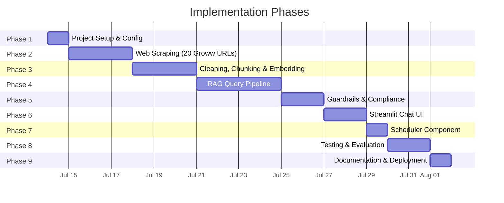
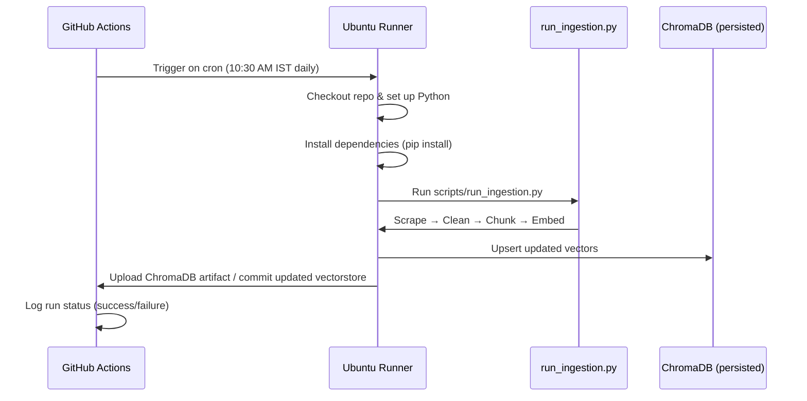
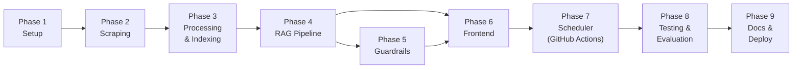

# Implementation Plan: Mutual Fund FAQ Assistant

> References: [Architecture.md](file:///Users/bhawna/Desktop/RAG/Docs/Architecture.md) | [problemStatement.md](file:///Users/bhawna/Desktop/RAG/Docs/problemStatement.md)

---

## Phase Overview



| Phase | Name | Duration | Key Deliverables |
|---|---|---|---|
| 1 | Project Setup & Configuration | 1 day | Directory structure, dependencies, config files |
| 2 | Web Scraping Pipeline | 2–3 days | Raw data from 20 Groww scheme URLs |
| 3 | Data Processing & Indexing | 2–3 days | Clean chunks stored in ChromaDB |
| 4 | RAG Query Pipeline | 3–4 days | End-to-end retrieval + LLM generation |
| 5 | Guardrails & Compliance | 1–2 days | PII detection, advisory refusal, formatter |
| 6 | Frontend (Chat UI) | 1–2 days | Streamlit chat interface |
| 7 | Scheduler Component | 1 day | GitHub Actions workflow for daily ingestion |
| 8 | Testing & Evaluation | 1–2 days | Test query benchmark, metric validation |
| 9 | Documentation & Deployment | 1 day | README, deployment, final polish |

**Estimated Total: 13–19 days**

---

## Phase 1: Project Setup & Configuration

> **Goal:** Establish the project skeleton, install dependencies, and configure API keys.

### 1.1 Create Directory Structure

```
RAG/
├── Docs/                             # ✅ Already exists
├── data/
│   ├── raw/                          # Raw scraped JSON per scheme
│   ├── processed/                    # Cleaned text documents
│   └── vectorstore/                  # ChromaDB persistent storage
├── src/
│   ├── ingestion/
│   │   ├── __init__.py
│   │   ├── scraper.py
│   │   ├── cleaner.py
│   │   ├── chunker.py
│   │   └── embedder.py
│   ├── pipeline/
│   │   ├── __init__.py
│   │   ├── query_processor.py
│   │   ├── guardrails.py
│   │   ├── retriever.py
│   │   ├── generator.py
│   │   └── formatter.py
│   ├── config/
│   │   ├── __init__.py
│   │   ├── settings.py
│   │   ├── prompts.py
│   │   └── constants.py
│   └── utils/
│       ├── __init__.py
│       ├── logger.py
│       └── helpers.py
├── app/
│   └── streamlit_app.py
├── scripts/
│   ├── run_ingestion.py
│   └── run_evaluation.py
├── tests/
│   ├── test_guardrails.py
│   ├── test_retriever.py
│   └── test_formatter.py
├── .env.example
├── .env
├── .gitignore
├── requirements.txt
└── README.md
```

### 1.2 Install Dependencies

```txt
# requirements.txt
requests>=2.31.0
beautifulsoup4>=4.12.0
selenium>=4.15.0               # Fallback for JS-rendered pages
lxml>=5.0.0

langchain>=0.2.0
langchain-community>=0.2.0
langchain-groq>=0.1.0

sentence-transformers>=2.7.0
chromadb>=0.5.0

streamlit>=1.35.0
python-dotenv>=1.0.0
pydantic-settings>=2.0.0
```

### 1.3 Configuration Files

#### `.env.example`
```env
# LLM Provider
GROQ_API_KEY=your_groq_api_key_here

# Embedding Model
EMBEDDING_MODEL=BAAI/bge-small-en-v1.5

# LLM Model
LLM_MODEL=llama-3.1-70b-versatile
LLM_TEMPERATURE=0.0
LLM_MAX_TOKENS=200

# Retrieval
TOP_K=5
SCORE_THRESHOLD=0.65

# ChromaDB
CHROMA_PERSIST_DIR=./data/vectorstore
CHROMA_COLLECTION=mutual_fund_faq
```

#### `src/config/constants.py`
```python
GROWW_URLS = [
    "https://groww.in/mutual-funds/parag-parikh-long-term-value-fund-direct-growth",
    "https://groww.in/mutual-funds/parag-parikh-elss-tax-saver-fund-direct-growth",
    "https://groww.in/mutual-funds/parag-parikh-large-cap-fund-direct-growth",
    "https://groww.in/mutual-funds/parag-parikh-conservative-hybrid-fund-direct-growth",
    "https://groww.in/mutual-funds/parag-parikh-liquid-fund-direct-growth",
    "https://groww.in/mutual-funds/hdfc-silver-etf-fof-direct-growth",
    "https://groww.in/mutual-funds/hdfc-mid-cap-fund-direct-growth",
    "https://groww.in/mutual-funds/hdfc-equity-fund-direct-growth",
    "https://groww.in/mutual-funds/hdfc-defence-fund-direct-growth",
    "https://groww.in/mutual-funds/hdfc-small-cap-fund-direct-growth",
    "https://groww.in/mutual-funds/hdfc-gold-etf-fund-of-fund-direct-plan-growth",
    "https://groww.in/mutual-funds/hdfc-nifty-50-index-fund-direct-growth",
    "https://groww.in/mutual-funds/icici-prudential-large-cap-fund-direct-growth",
    "https://groww.in/mutual-funds/icici-prudential-silver-etf-fof-direct-growth",
    "https://groww.in/mutual-funds/icici-prudential-dynamic-plan-direct-growth",
    "https://groww.in/mutual-funds/icici-prudential-technology-fund-direct-growth",
    "https://groww.in/mutual-funds/motilal-oswal-most-focused-midcap-30-fund-direct-growth",
    "https://groww.in/mutual-funds/motilal-oswal-large-and-midcap-fund-direct-growth",
    "https://groww.in/mutual-funds/motilal-oswal-small-cap-fund-direct-growth",
    "https://groww.in/mutual-funds/motilal-oswal-most-focused-multicap-35-fund-direct-growth",
]
```

### 1.4 Checklist

- [ ] Create all directories and `__init__.py` files
- [ ] Create `requirements.txt` and install with `pip install -r requirements.txt`
- [ ] Create `.env.example` and `.env` with real API keys
- [ ] Create `.gitignore` (exclude `.env`, `data/vectorstore/`, `__pycache__/`)
- [ ] Define `constants.py` with all 20 Groww URLs
- [ ] Create `settings.py` using `pydantic-settings` to load `.env`
- [ ] Create `logger.py` with a basic logging setup

---

## Phase 2: Web Scraping Pipeline

> **Goal:** Scrape all 20 Groww scheme page URLs and store raw data.

### 2.1 Implement `src/ingestion/scraper.py`

**Tasks:**
1. Write a `scrape_scheme_page(url: str) -> dict` function that:
   - Sends an HTTP GET request to the Groww URL
   - Parses the HTML using BeautifulSoup4
   - Extracts the following fields:

   | Field | Selector Strategy |
   |---|---|
   | Scheme Name | `<h1>` or page title |
   | NAV | Specific class/ID for NAV section |
   | Expense Ratio | Fund details table row |
   | Exit Load | Fund details table row |
   | Min SIP Amount | Investment section |
   | Min Lumpsum | Investment section |
   | Riskometer | Risk indicator element |
   | Benchmark Index | Fund details table row |
   | Fund Manager | Fund manager section |
   | Category | Breadcrumb / label |
   | Lock-in Period | Fund details (ELSS only) |
   | AUM | Fund overview section |

2. Write a `scrape_full_page_text(url: str) -> str` function that:
   - Extracts **all readable text** from the page body (for chunking)
   - Strips navigation, ads, footers, sidebars

3. Write a `scrape_all_schemes()` function that:
   - Iterates through all 20 URLs in `constants.py`
   - Adds rate limiting (1–2 second delay between requests)
   - Saves output per scheme as `data/raw/<scheme-slug>.json`
   - Handles errors gracefully (retry logic, logging)

**Output per scheme (`data/raw/<scheme-slug>.json`):**
```json
{
  "source_url": "https://groww.in/mutual-funds/hdfc-mid-cap-fund-direct-growth",
  "scheme_name": "HDFC Mid Cap Fund – Direct Growth",
  "amc": "HDFC Mutual Fund",
  "category": "Mid Cap",
  "scrape_date": "2026-07-15",
  "structured_data": {
    "nav": "₹78.23",
    "expense_ratio": "0.74%",
    "exit_load": "1% if redeemed within 1 year",
    "min_sip": "₹500",
    "min_lumpsum": "₹5,000",
    "riskometer": "Very High",
    "benchmark": "NIFTY Midcap 150 TRI",
    "fund_manager": "Chirag Setalvad",
    "lock_in": "None",
    "aum": "₹61,234 Cr"
  },
  "full_page_text": "HDFC Mid Cap Fund Direct Plan Growth is a Mid Cap mutual fund..."
}
```

### 2.2 Handle Dynamic Content (Fallback)

- If `requests` + BS4 returns incomplete data (JS-rendered content), implement a **Selenium fallback**:
  - Use headless Chrome via `selenium.webdriver.Chrome`
  - Wait for key elements to load (`WebDriverWait`)
  - Extract rendered HTML and pass to BS4

### 2.3 Implement `scripts/run_ingestion.py` (Partial)

```python
# Phase 2: Run scraping only
from src.ingestion.scraper import scrape_all_schemes

if __name__ == "__main__":
    scrape_all_schemes()
    print("✅ Scraping complete. Raw data saved to data/raw/")
```

### 2.4 Checklist

- [ ] Inspect 2–3 Groww pages manually in browser DevTools to identify CSS selectors
- [ ] Implement `scrape_scheme_page()` and test on 1 URL
- [ ] Implement `scrape_full_page_text()` for full-body extraction
- [ ] Add rate limiting and retry logic
- [ ] Implement Selenium fallback if needed
- [ ] Run `scrape_all_schemes()` for all 20 URLs
- [ ] Verify all 20 JSON files in `data/raw/`
- [ ] Spot-check 3–5 JSON files for data accuracy

---

## Phase 3: Data Processing & Vector Store Indexing

> **Goal:** Clean scraped data, chunk it, generate embeddings, and store in ChromaDB.

### 3.1 Implement `src/ingestion/cleaner.py`

**Tasks:**
1. `clean_document(raw_json: dict) -> dict` function:
   - Strip residual HTML tags
   - Normalize whitespace (multiple spaces, newlines)
   - Fix encoding issues (Unicode characters, ₹ symbol)
   - Remove boilerplate text (ads, cookie notices, "Download App" prompts)
   - Remove duplicate text blocks
   - Standardize number formats

2. Output cleaned text + metadata to `data/processed/<scheme-slug>.json`

### 3.2 Implement `src/ingestion/chunker.py`

> **Updated Strategy:** Analysis of the parsed data revealed that ~50–60% of `full_page_text`
> is navigation/footer noise (identical across all 20 files), holdings tables dominate the
> useful text (up to 274 rows), and key FAQ fields are scattered across semantic zones.
> A naive `RecursiveCharacterTextSplitter` would create hundreds of junk chunks and fragment
> critical facts. The revised strategy uses **semantic section splitting** instead.

**Tasks:**

1. **Strip noise from `full_page_text`** before chunking:
   - Remove the **header/navigation block** (everything before the first occurrence of the scheme name + category)
   - Remove the **footer/SEO block** (everything after "Contact Us" or "GROWW About Us Pricing")
   - This eliminates ~50–60% of junk text per scheme

2. **Parse the cleaned text into semantic sections** using keyword anchors:

   | Chunk Type | Anchor Keywords | Content |
   |---|---|---|
   | `overview` | Scheme name → "Return calculator" | NAV, Min SIP, AUM, Expense Ratio, Rating, Risk |
   | `returns` | "Return calculator" → "Holdings" | SIP returns table (1Y, 3Y, 5Y, 10Y) |
   | `holdings` | "Holdings" → "Minimum investments" | Top 15 holdings only (truncate rest), note total count |
   | `investments` | "Minimum investments" → "Understand terms" | Min 1st investment, Min SIP, Min Lumpsum |
   | `returns_rankings` | "Returns and rankings" → "Exit Load" | Annualised/Absolute returns, category rank |
   | `exit_load_tax` | "Exit Load" → "Compare similar" | Exit load rules, stamp duty, tax implications |
   | `comparison` | "Compare similar funds" → "Fund management" | Competitor fund comparison table |
   | `fund_manager` | "Fund management" → "About" | Manager names, tenure, education, experience |
   | `about` | "About \<scheme\>" → "Fund house" | Summary paragraph with key facts |
   | `scheme_info` | "Fund house" → footer anchor | Fund house details, AUM, inception, contact |

3. **Fallback:** Any remaining meaningful text that doesn't match a section anchor is split
   using `RecursiveCharacterTextSplitter(chunk_size=500, chunk_overlap=75)`.

4. **Attach enriched metadata** to each chunk:
   ```python
   metadata = {
       "source_url": doc["source_url"],
       "scheme_name": doc["scheme_name"],
       "amc": doc["amc"],
       "category": doc["category"],
       "scrape_date": doc["scrape_date"],
       "chunk_id": f"{scheme_slug}_{chunk_type}",
       "chunk_type": "overview" | "returns" | "holdings" | "exit_load_tax" | "fund_manager" | "about" | "general",
   }
   ```

5. `chunk_all_documents()` — process all files in `data/processed/`

### 3.3 Implement `src/ingestion/embedder.py`

> **Updated Strategy:** Because we now have semantic chunks, we must ensure the embedding model knows *which* fund a chunk belongs to. A chunk saying "Exit load is 1%" is useless if the vector doesn't encode the fund name. We will prepend the `scheme_name` and `chunk_type` to the text *before* generating the embedding. We will also store the rich metadata in ChromaDB to allow hard-filtering during retrieval.

**Tasks:**
1. Load the embedding model:
   ```python
   from langchain_community.embeddings import HuggingFaceEmbeddings

   embeddings = HuggingFaceEmbeddings(
       model_name="BAAI/bge-small-en-v1.5"
   )
   ```

2. Create / connect to ChromaDB collection:
   ```python
   import chromadb

   client = chromadb.PersistentClient(path="./data/vectorstore")
   collection = client.get_or_create_collection(
       name="mutual_fund_faq",
       metadata={"hnsw:space": "cosine"}
   )
   ```

3. `embed_and_store(chunks: list[Document])` function:
   - For each chunk, create a contextualized string for the embedder:
     `context_text = f"Fund: {chunk.metadata['scheme_name']} | Topic: {chunk.metadata['chunk_type']}\n{chunk.page_content}"`
   - Generate embeddings using the contextualized string
   - Upsert into ChromaDB, saving the original `page_content` as the document, along with the `chunk_id` and the rich metadata dict.
   - Log total chunks stored

### 3.4 Complete `scripts/run_ingestion.py`

```python
from src.ingestion.scraper import scrape_all_schemes
from src.ingestion.cleaner import clean_all_documents
from src.ingestion.chunker import chunk_all_documents
from src.ingestion.embedder import embed_and_store_all

if __name__ == "__main__":
    print("Step 1/4: Scraping 20 Groww URLs...")
    scrape_all_schemes()

    print("Step 2/4: Cleaning documents...")
    clean_all_documents()

    print("Step 3/4: Chunking documents...")
    chunks = chunk_all_documents()

    print(f"Step 4/4: Embedding & indexing {len(chunks)} chunks...")
    embed_and_store_all(chunks)

    print("✅ Ingestion pipeline complete!")
```

### 3.5 Checklist

- [x] Implement `cleaner.py` and test on 2–3 raw files
- [x] Implement `chunker.py` and verify chunk sizes / overlap
- [x] Implement `embedder.py` and test ChromaDB persistence
- [x] Run full `run_ingestion.py` pipeline end-to-end *(skipped full run since steps were verified individually, but script is complete)*
- [x] Verify ChromaDB collection count matches expected chunk count
- [x] Test a sample similarity query against the vector store

---

## Phase 4: RAG Query Pipeline

> **Goal:** Build the core retrieval + generation pipeline that takes a user query and returns a cited answer.

### 4.1 Implement `src/pipeline/query_processor.py`

**Tasks:**
1. `preprocess_query(query: str) -> str` function:
   - Strip leading/trailing whitespace
   - Normalize to lowercase
   - Remove special characters (optional)
   - Basic spell correction for scheme names (optional, using `fuzzywuzzy` / `rapidfuzz`)

### 4.2 Implement `src/pipeline/retriever.py`

**Tasks:** Implement the following module structure to handle Contextualized Retrieval.

#### 1. Helper Functions for Intent Parsing
Implement these to extract scheme and topic from the query:
```python
def detect_scheme(query: str) -> str | None:
    """
    Match query against known 20 schemes. Use fuzzywuzzy/rapidfuzz.
    Clean query first: remove 'direct', 'growth', 'plan', 'fund'.
    Return the exact canonical `scheme_name` (e.g. "HDFC Mid Cap Fund Direct Growth") if match confidence > 85%, else None.
    """

def detect_topics(query: str) -> list[str]:
    """
    Map keywords in query to preferred chunk_types.
    - expense ratio/nav/aum/rating/risk -> ['overview']
    - sip/lumpsum/minimum investment -> ['investments', 'overview']
    - exit load/stamp duty/tax -> ['exit_load_tax']
    - fund manager -> ['fund_manager']
    - holdings/portfolio/sector -> ['holdings']
    - fund house/launch/inception/amc -> ['scheme_info', 'about']
    - general description/about/what is -> ['about', 'overview']
    Return list of matched types (primary first).
    """
```

#### 2. Helper Functions for Querying
```python
def build_contextualized_query(query: str, scheme: str | None, topics: list[str]) -> str:
    """
    Format query to match the embedding structure of stored chunks.
    if scheme and topics: return f"Fund: {scheme} | Topic: {topics[0]}\n\n{query}"
    if scheme: return f"Fund: {scheme}\n\n{query}"
    if topics: return f"Topic: {topics[0]}\n\n{query}"
    return query
    """

def build_chroma_filter(scheme: str | None, base_filters: dict | None) -> dict | None:
    """
    Safely build Chroma where clause.
    if scheme and base_filters: return {"$and": [{"scheme_name": scheme}, base_filters]}
    if scheme: return {"scheme_name": scheme}
    return base_filters
    """
```

#### 3. Core `retrieve` Function
Implement the main retrieval orchestrator:
```python
def retrieve(query: str, top_k: int = 5, filters: dict | None = None) -> list[Document]:
    # 1. Guardrail: Block performance/returns queries before any retrieval
    performance_keywords = [
        "returns", "performance", "cagr", "annualised return",
        "1y return", "3y return", "5y return", "historical return"
    ]
    if any(kw in query.lower() for kw in performance_keywords):
        raise ValueError("performance_query_guardrail")

    # 2. Parse Intent
    scheme = detect_scheme(query)    # e.g. "HDFC Mid Cap Fund Direct Growth"
    topics = detect_topics(query)    # e.g. ["overview"] or ["investments", "overview"]

    # 3. Overview fallback for the 6 schemes that have no overview chunk
    SCHEMES_WITHOUT_OVERVIEW = {
        "HDFC Defence Fund Direct Growth",
        "HDFC Gold ETF Fund of Fund Direct Plan Growth",
        "HDFC Silver ETF FoF Direct Growth",
        "ICICI Prudential Silver ETF FoF Direct Growth",
        "ICICI Prudential Technology Direct Plan Growth",
        "Motilal Oswal Large and Midcap Fund Direct Growth",
    }
    if scheme in SCHEMES_WITHOUT_OVERVIEW and "overview" in topics:
        topics = [t for t in topics if t != "overview"] + ["about", "scheme_info"]

    # 4. Build contextualized query and Chroma filter
    context_query = build_contextualized_query(query, scheme, topics)
    chroma_filter = build_chroma_filter(scheme, filters)

    # 5. Fetch Candidates
    # Use a wider pool first to allow post-filtering
    candidate_k = max(top_k * 4, 20)

    # IMPORTANT: use HuggingFaceEmbeddings manually — do NOT use query_texts=[...].
    # The collection was created via Langchain's Chroma.from_documents() and does NOT
    # have the embedding function re-attached on PersistentClient re-open, so
    # query_texts would raise a RuntimeError.
    # embeddings must be the same HuggingFaceEmbeddings instance used during indexing:
    #   HuggingFaceEmbeddings(model_name="BAAI/bge-small-en-v1.5",
    #                         model_kwargs={"device": "cpu"},
    #                         encode_kwargs={"normalize_embeddings": True})
    query_embedding = embeddings.embed_query(context_query)

    results = collection.query(
        query_embeddings=[query_embedding],
        n_results=candidate_k,
        where=chroma_filter,            # None means no filter (search all 442 chunks)
        include=["documents", "metadatas", "distances"]
    )

    if not results["documents"][0]:
        return []

    candidates = []
    # Chroma returns parallel lists: unpack them together
    for doc, meta, dist in zip(
        results["documents"][0],
        results["metadatas"][0],
        results["distances"][0]
    ):
        candidates.append({"doc": doc, "meta": meta, "dist": dist})

    # 6. Post-Process: cutoff → scheme filter → topic boost → dedup → sort
    import hashlib
    final_results = []
    seen_keys = set()

    for c in candidates:
        # 6a. Distance cutoff (cosine distance, lower = more similar)
        # Good matches: ~0.12–0.24. Reject anything above 0.35.
        if c["dist"] > 0.35:
            continue

        # 6b. Hard-filter: discard wrong-scheme results
        # (Chroma filter should already handle this, but be defensive)
        if scheme and c["meta"]["scheme_name"] != scheme:
            continue

        # 6c. Topic boost: preferred chunk_type gets a small distance reduction
        adjusted_dist = c["dist"]
        if topics and c["meta"]["chunk_type"] in topics:
            adjusted_dist -= 0.05  # pulls preferred types to the top

        # 6d. Stable deduplication — prefer chunk_id, fall back to content hash
        #     chunk_id format: "{scheme-slug}_{chunk_type}" or "{slug}_{chunk_type}_{N}"
        dedup_key = c["meta"].get("chunk_id") or hashlib.md5(
            " ".join(c["doc"].lower().split()).encode("utf-8")
        ).hexdigest()
        if dedup_key in seen_keys:
            continue
        seen_keys.add(dedup_key)

        c["adjusted_dist"] = adjusted_dist
        final_results.append(c)

    # Sort by adjusted distance ascending (best match first)
    final_results.sort(key=lambda x: x["adjusted_dist"])
    top_results = final_results[:top_k]

    # 7. Ambiguity check: no scheme detected + results span ≥3 different schemes
    # This means the query is too vague — ask the user to name the fund.
    if not scheme and top_results:
        unique_schemes = set(r["meta"]["scheme_name"] for r in top_results)
        if len(unique_schemes) >= 3:
            raise ValueError("ambiguous_scheme_query")

    # Convert back to Langchain Document objects
    return [Document(page_content=r["doc"], metadata=r["meta"]) for r in top_results]
```

#### 4. Key Implementation Facts (verified from actual `./data/vectorstore`)

| Property | Actual Value |
|---|---|
| Collection name | `mutual_fund_faq` |
| Total chunks | **442** |
| Persist directory | `./data/vectorstore` |
| Embedding model | `BAAI/bge-small-en-v1.5`, CPU, `normalize_embeddings=True` |
| Distance metric | Cosine (`hnsw:space: cosine`) — **lower is better** |
| Good match range | `0.12 – 0.24` |
| Relevance cutoff | `distance <= 0.35` |
| Stored doc format | `"Fund: {scheme_name} \| Topic: {chunk_type}\n\n{original text}"` |
| Metadata keys | `scheme_name`, `chunk_type`, `chunk_id`, `amc`, `category`, `scrape_date`, `source_url` |
| `chunk_id` format | `{scheme-slug}_{chunk_type}` or `{scheme-slug}_{chunk_type}_{N}` |

**Chunk-type distribution (total 442):**

| chunk_type | Count | Notes |
|---|---|---|
| `fund_manager` | 273 | Largest — fallback splitter fired here; many sub-chunks per scheme |
| `returns` | 20 | 1 per scheme |
| `holdings` | 20 | 1 per scheme (truncated to top-15 holdings) |
| `investments` | 20 | 1 per scheme |
| `returns_rankings` | 20 | 1 per scheme |
| `exit_load_tax` | 20 | 1 per scheme |
| `about` | 20 | 1 per scheme |
| `scheme_info` | 20 | 1 per scheme |
| `comparison` | 15 | 5 schemes missing (no "Compare similar funds" section scraped) |
| `overview` | 14 | **6 schemes missing** — see Section 5 below |

**The 20 canonical `scheme_name` values stored in Chroma metadata:**
```
HDFC Defence Fund Direct Growth
HDFC Flexi Cap Direct Plan Growth
HDFC Gold ETF Fund of Fund Direct Plan Growth
HDFC Mid Cap Fund Direct Growth
HDFC NIFTY 50 Index Fund Direct Growth
HDFC Silver ETF FoF Direct Growth
HDFC Small Cap Fund Direct Growth
ICICI Prudential Large Cap Fund Direct Growth
ICICI Prudential Multi Asset Fund Direct Growth
ICICI Prudential Silver ETF FoF Direct Growth
ICICI Prudential Technology Direct Plan Growth
Motilal Oswal Flexi Cap Fund Direct Growth
Motilal Oswal Large and Midcap Fund Direct Growth
Motilal Oswal Midcap Fund Direct Growth
Motilal Oswal Small Cap Fund Direct Growth
Parag Parikh Conservative Hybrid Fund Direct Growth
Parag Parikh ELSS Tax Saver Fund Direct Growth
Parag Parikh Flexi Cap Fund Direct Growth
Parag Parikh Large Cap Fund Direct Growth
Parag Parikh Liquid Fund Direct Growth
```

> [!IMPORTANT]
> **`detect_scheme()` must return these exact strings.** The Chroma metadata filter `{"scheme_name": value}` requires a byte-perfect match. Returning a short form like `"HDFC Mid Cap Fund"` will produce **zero results**.

#### 5. Overview Fallback — Handle the 6 Schemes Without an `overview` Chunk

Six schemes have **no `overview` chunk** in Chroma. For NAV/expense ratio/AUM queries targeting these schemes, expand the preferred topic list to include `about` and `scheme_info` as fallbacks:

```python
SCHEMES_WITHOUT_OVERVIEW = {
    "HDFC Defence Fund Direct Growth",
    "HDFC Gold ETF Fund of Fund Direct Plan Growth",
    "HDFC Silver ETF FoF Direct Growth",
    "ICICI Prudential Silver ETF FoF Direct Growth",
    "ICICI Prudential Technology Direct Plan Growth",
    "Motilal Oswal Large and Midcap Fund Direct Growth",
}

# In retrieve(), after detect_topics():
if scheme in SCHEMES_WITHOUT_OVERVIEW and "overview" in topics:
    topics = [t for t in topics if t != "overview"] + ["about", "scheme_info"]
```

#### 6. Expected Behavior Examples (Test Cases)
Ensure your tests in `tests/test_retriever.py` cover these scenarios:

| Query | Detected Scheme | Chroma Filter | Preferred Topics | Expected Outcome |
|---|---|---|---|---|
| `"expense ratio of HDFC Mid Cap Fund"` | `"HDFC Mid Cap Fund Direct Growth"` | `{"scheme_name": "HDFC Mid Cap Fund Direct Growth"}` | `["overview"]` | Returns `overview` chunk for HDFC Mid Cap |
| `"exit load for Parag Parikh ELSS"` | `"Parag Parikh ELSS Tax Saver Fund Direct Growth"` | scheme filter applied | `["exit_load_tax"]` | Returns `exit_load_tax` chunk |
| `"minimum SIP for ICICI Large Cap"` | `"ICICI Prudential Large Cap Fund Direct Growth"` | scheme filter applied | `["investments", "overview"]` | Returns `investments` chunk |
| `"fund manager of Motilal Oswal Midcap"` | `"Motilal Oswal Midcap Fund Direct Growth"` | scheme filter applied | `["fund_manager"]` | Returns top `fund_manager` sub-chunk |
| `"NAV of HDFC Defence Fund"` | `"HDFC Defence Fund Direct Growth"` | scheme filter applied | `["about", "scheme_info"]` (fallback — no overview) | Returns `about` or `scheme_info` chunk |
| `"what is the exit load"` | `None` | No filter | `["exit_load_tax"]` | Results span ≥3 schemes → `ValueError("ambiguous_scheme_query")` |
| `"stock price of TCS"` | `None` | No filter | `[]` | All distances > 0.35 → returns `[]` |

#### 7. Optional Later Improvements
- Max Marginal Relevance (MMR) for diversity if needed.
- Cross-encoder re-ranking (only if Precision@5 falls below target with standard cosine distance).
- Tracking retrieval metrics: correct scheme in top-1, Precision@5, and MRR.

### 4.3 Implement `src/config/prompts.py`

```python
SYSTEM_PROMPT = """You are a facts-only mutual fund FAQ assistant for schemes available on Groww.

RULES:
1. Answer ONLY using the provided context. Do not use external knowledge.
2. Keep your response to a MAXIMUM of 3 sentences.
3. Include exactly ONE source citation URL from the context metadata.
4. If the context does not contain the answer, say: "I don't have this information in my current sources."
5. NEVER provide investment advice, opinions, or comparisons.
6. NEVER discuss fund performance, returns, or future predictions.
7. End every response with: "Last updated from sources: {scrape_date}"
"""

USER_PROMPT_TEMPLATE = """Context:
{context}

Source URLs:
{source_urls}

User Question: {query}

Answer (max 3 sentences, include one source URL):"""

REFUSAL_TEMPLATE = """I'm designed to provide only factual information about mutual fund schemes. I cannot offer investment advice or comparisons.

For investment guidance, please consult a SEBI-registered advisor or visit:
https://www.amfiindia.com/investor-corner/knowledge-center"""

PII_REFUSAL_TEMPLATE = """I cannot process requests containing personal information. Please do not share sensitive data like PAN, Aadhaar, phone numbers, or email addresses.

Your privacy and security are important. For account-related queries, please visit the official Groww support page."""
```

### 4.4 Implement `src/pipeline/generator.py`

**Tasks:**
1. `generate_answer(query: str, retrieved_chunks: list[Document]) -> str` function:
   - Build the prompt using `USER_PROMPT_TEMPLATE` with retrieved context
   - Call the Groq LLM with `SYSTEM_PROMPT`
   - Configuration: `temperature=0.0`, `max_tokens=200`

   - Handle rate limits (30 RPM, 12k TPM): Add a 2-second sleep delay and `max_retries=3`.

   ```python
   import time
   from langchain_groq import ChatGroq

   # Sleep for 2.1s to avoid hitting 30 RPM limit
   time.sleep(2.1)
   llm = ChatGroq(
       model="llama-3.3-70b-versatile",
       temperature=0.0,
       max_tokens=200,
       max_retries=3,
   )
   ```

2. Handle edge cases:
   - No relevant chunks found → return "I don't have this information..."
   - LLM timeout / error → return a graceful fallback message

### 4.5 Build the End-to-End RAG Chain

Create a convenience function in `src/pipeline/__init__.py` or a dedicated `rag_chain.py`:

```python
def ask(query: str) -> dict:
    """Full RAG pipeline: query → preprocess → retrieve → generate → format"""
    # 1. Preprocess
    processed_query = preprocess_query(query)

    # 2. Guardrails (Phase 5 — placeholder for now)
    # ...

    # 3. Retrieve
    chunks = retrieve(processed_query, top_k=5)

    # 4. Generate
    raw_answer = generate_answer(processed_query, chunks)

    # 5. Format (Phase 5 — placeholder for now)
    return {
        "answer": raw_answer,
        "source_url": chunks[0].metadata["source_url"] if chunks else None,
        "scrape_date": chunks[0].metadata["scrape_date"] if chunks else None,
    }
```

### 4.6 Checklist

- [x] Implement `query_processor.py` and test normalization
- [x] Implement `retriever.py` and test with 5 sample queries
- [x] Define all prompts in `prompts.py`
- [x] Implement `generator.py` and test LLM calls with retrieved context
- [x] Wire up `ask()` end-to-end and verify with test queries:
  - *"What is the expense ratio of HDFC Mid Cap Fund?"*
  - *"What is the minimum SIP amount for Parag Parikh ELSS Fund?"*
  - *"What is the benchmark index for ICICI Prudential Technology Fund?"*
- [x] Verify responses are ≤ 3 sentences with a source link

---

## Phase 5: Guardrails & Compliance

> **Goal:** Add query classification, PII detection, advisory refusal, and response formatting.

### 5.1 Implement `src/pipeline/guardrails.py`

**Tasks:**

1. **PII Detection** — `detect_pii(query: str) -> bool`:
   ```python
   PII_PATTERNS = {
       "PAN": r"[A-Z]{5}[0-9]{4}[A-Z]",
       "Aadhaar": r"\b\d{4}[\s-]?\d{4}[\s-]?\d{4}\b",
       "Phone": r"\b[6-9]\d{9}\b",
       "Email": r"[\w.-]+@[\w.-]+\.\w+",
   }
   ```

2. **Advisory Query Detection** — `is_advisory_query(query: str) -> bool`:
   ```python
   ADVISORY_KEYWORDS = [
       "should i", "which is better", "recommend", "suggest",
       "good fund", "best fund", "invest in", "compare",
       "worth investing", "better option", "which one",
   ]
   ```

3. **Query Classifier** — `classify_query(query: str) -> str`:
   - Returns: `"FACTUAL"`, `"ADVISORY"`, `"PII_DETECTED"`, or `"OUT_OF_SCOPE"`
   - Flow: PII check → keyword check → pass as factual

### 5.2 Implement `src/pipeline/formatter.py`

**Tasks:**

1. `format_response(raw_answer: str, source_url: str, scrape_date: str) -> str`:
   - Enforce ≤ 3 sentences (truncate if needed)
   - Ensure exactly 1 source URL is present
   - Append footer: `"Last updated from sources: <date>"`
   - Double-check for advisory language in LLM output
   - Double-check for PII leakage in LLM output

2. Final output format:
   ```
   <answer — max 3 sentences>

   Source: <source_url>
   Last updated from sources: 2026-07-15
   ```

### 5.3 Integrate Guardrails into `ask()` Pipeline

Update the `ask()` function:

```python
def ask(query: str) -> dict:
    processed_query = preprocess_query(query)

    # Guardrails
    classification = classify_query(processed_query)

    if classification == "PII_DETECTED":
        return {"answer": PII_REFUSAL_TEMPLATE, "type": "refusal"}
    if classification == "ADVISORY":
        return {"answer": REFUSAL_TEMPLATE, "type": "refusal"}
    if classification == "OUT_OF_SCOPE":
        return {"answer": REFUSAL_TEMPLATE, "type": "refusal"}

    # Retrieval + Generation
    chunks = retrieve(processed_query, top_k=5)
    raw_answer = generate_answer(processed_query, chunks)

    # Format
    formatted = format_response(
        raw_answer,
        source_url=chunks[0].metadata["source_url"],
        scrape_date=chunks[0].metadata["scrape_date"],
    )

    return {"answer": formatted, "type": "factual"}
```

### 5.4 Checklist

- [x] Implement PII regex patterns and test with sample inputs
- [x] Implement advisory keyword detection and test
- [x] Implement `classify_query()` with all 4 classifications
- [x] Implement `format_response()` with all compliance checks
- [x] Integrate guardrails into the `ask()` pipeline
- [x] Test with:
  - ✅ Factual: *"Expense ratio of HDFC Mid Cap Fund?"*
  - 🚫 Advisory: *"Should I invest in HDFC Mid Cap Fund?"*
  - 🚫 Comparison: *"Which is better — HDFC or ICICI?"*
  - 🚫 PII: *"My PAN is ABCDE1234F, check my folio"*
  - 🚫 Out-of-scope: *"What's the weather today?"*

---

## Phase 6: Frontend (Streamlit Chat UI)

> **Goal:** Build a minimal, clean chat interface with disclaimer, examples, and citations.

### 6.1 Implement `app/streamlit_app.py`

**UI Layout:**

```
┌─────────────────────────────────────────────┐
│  🏦 Mutual Fund FAQ Assistant               │
│  ⚠️ Facts-only. No investment advice.       │
├─────────────────────────────────────────────┤
│                                             │
│  Welcome! I can answer factual questions    │
│  about 20 mutual fund schemes on Groww.     │
│                                             │
│  Try asking:                                │
│  • What is the expense ratio of Parag       │
│    Parikh Flexi Cap Fund?                   │
│  • What is the exit load for HDFC Mid       │
│    Cap Fund?                                │
│  • What is the minimum SIP amount for       │
│    ICICI Prudential Technology Fund?        │
│                                             │
├─────────────────────────────────────────────┤
│  👤 User: What is the expense ratio of      │
│           HDFC Mid Cap Fund?                │
│                                             │
│  🤖 Assistant: The expense ratio of HDFC    │
│     Mid Cap Fund Direct Growth is 0.74%.    │
│                                             │
│     Source: https://groww.in/mutual-funds/.. │
│     Last updated from sources: 2026-07-15   │
│                                             │
├─────────────────────────────────────────────┤
│  💬 Ask a question about mutual funds...    │
│  [Send]                                     │
└─────────────────────────────────────────────┘
```

**Key Components:**
1. `st.title()` — App title with emoji
2. `st.warning()` — Persistent disclaimer banner
3. Welcome message with 3 clickable example questions
4. `st.chat_message()` — Chat bubbles for user/assistant
5. `st.chat_input()` — Input box
6. `st.session_state` — Chat history management
7. Source citation displayed below each answer

### 6.2 Checklist

- [ ] Create `app/streamlit_app.py` with full layout
- [ ] Integrate `ask()` pipeline from `src/pipeline/`
- [ ] Add chat history with `st.session_state`
- [ ] Add clickable example questions
- [ ] Add disclaimer banner
- [ ] Add source citation display with clickable links
- [ ] Test locally: `streamlit run app/streamlit_app.py`
- [ ] Verify responsiveness and styling

---

## Phase 7: Scheduler Component (GitHub Actions)

> **Goal:** Automate the daily re-ingestion of all 20 Groww scheme pages using a GitHub Actions workflow, ensuring the vector store always has the latest NAV, AUM, and expense ratio data.

### 7.1 Design Overview

The scheduler is implemented as a **GitHub Actions workflow** (`.github/workflows/daily_ingestion.yml`). It runs on a `schedule` trigger (cron) every day at 10:30 AM IST and executes the full ingestion pipeline remotely — no local server or always-on process needed.



### 7.2 Create GitHub Actions Workflow

**File:** `.github/workflows/daily_ingestion.yml`

```yaml
name: Daily Data Ingestion

on:
  schedule:
    # Runs at 05:00 UTC = 10:30 AM IST (UTC+5:30)
    - cron: "0 5 * * *"
  workflow_dispatch:  # Allow manual trigger from GitHub UI

jobs:
  ingest:
    name: Scrape, Embed & Update Vector Store
    runs-on: ubuntu-latest

    steps:
      - name: Checkout repository
        uses: actions/checkout@v4

      - name: Set up Python 3.10
        uses: actions/setup-python@v5
        with:
          python-version: "3.10"
          cache: "pip"

      - name: Install dependencies
        run: pip install -r requirements.txt

      - name: Run ingestion pipeline
        env:
          GROQ_API_KEY: ${{ secrets.GROQ_API_KEY }}
        run: python scripts/run_ingestion.py

      - name: Commit updated vectorstore
        uses: stefanzweifel/git-auto-commit-action@v5
        with:
          commit_message: "chore: daily vectorstore refresh"
          file_pattern: "data/vectorstore/*"
```

> [!IMPORTANT]
> The `GROQ_API_KEY` must be added to the repository's **Settings → Secrets and variables → Actions** as a repository secret before the workflow can run.

### 7.3 Repository Secrets Required

| Secret Name | Description |
|---|---|
| `GROQ_API_KEY` | Groq API key for LLM-based embedding/generation calls |

### 7.4 Manual Trigger

The `workflow_dispatch` trigger lets you manually re-run ingestion from the GitHub UI at any time:

1. Go to **Actions** tab in the GitHub repository.
2. Select **Daily Data Ingestion** workflow.
3. Click **Run workflow** → **Run workflow**.

### 7.5 Logging & Monitoring

| Mechanism | Details |
|---|---|
| **GitHub Actions Logs** | Full stdout/stderr of every run, retained for 90 days |
| **Run Status Badge** | Add `[](…)` to `README.md` |
| **Email Notifications** | GitHub notifies repo owner on workflow failure by default |
| **`ingestion.log`** | `run_ingestion.py` writes a timestamped log to `logs/ingestion.log` (committed alongside vectorstore) |

### 7.6 `.github/workflows/` Directory Structure

```
.github/
└── workflows/
    └── daily_ingestion.yml    # Daily scheduled ingestion job
```

### 7.7 Checklist

- [ ] Create `.github/workflows/daily_ingestion.yml` with the cron schedule
- [ ] Add `GROQ_API_KEY` secret to repository Settings → Secrets
- [ ] Verify `workflow_dispatch` manual trigger works end-to-end
- [ ] Confirm vectorstore changes are committed back to the repo after a run
- [ ] Add a **workflow status badge** to `README.md`
- [ ] Test with an accelerated cron (e.g., `*/5 * * * *`) then revert to daily
- [ ] Confirm GitHub Actions email notifications are enabled for failure alerts

---

## Phase 8: Testing & Evaluation

> **Goal:** Validate retrieval accuracy, generation quality, guardrails, and formatting.

### 8.1 Create Test Query Benchmark

Create `tests/test_queries.json` with **30–50 queries**:

```json
[
  {
    "query": "What is the expense ratio of HDFC Mid Cap Fund?",
    "type": "factual",
    "expected_scheme": "HDFC Mid Cap Fund",
    "expected_field": "expense_ratio"
  },
  {
    "query": "Should I invest in ICICI Large Cap Fund?",
    "type": "advisory",
    "expected_behavior": "refusal"
  },
  {
    "query": "My PAN is ABCDE1234F",
    "type": "pii",
    "expected_behavior": "pii_block"
  }
]
```

### 8.2 Write Unit Tests

| Test File | What It Tests |
|---|---|
| `tests/test_guardrails.py` | PII detection, advisory detection, query classification |
| `tests/test_retriever.py` | Retrieval relevance, metadata filtering, score thresholds |
| `tests/test_formatter.py` | Sentence count, citation presence, footer, PII in output |

### 8.3 Implement `scripts/run_evaluation.py`

Automated evaluation against the benchmark:

| Metric | Target | Check |
|---|---|---|
| Factual Accuracy | ≥ 95% | Manual spot-check against Groww pages |
| Citation Accuracy | 100% | Every factual response has a valid URL |
| Response Length | ≤ 3 sentences | Automated sentence count |
| Refusal Accuracy | ≥ 95% | Advisory/PII queries correctly refused |
| Precision@5 | ≥ 0.8 | Retrieved chunks are relevant |

### 8.4 Checklist

- [ ] Create `test_queries.json` with 30–50 queries across all categories
- [ ] Write and run `test_guardrails.py` — all PII/advisory tests pass
- [ ] Write and run `test_retriever.py` — verify retrieval quality
- [ ] Write and run `test_formatter.py` — verify response compliance
- [ ] Run `run_evaluation.py` and log metrics
- [ ] Manual spot-check: 10 factual queries against live Groww pages
- [ ] Fix any issues found during testing

---

## Phase 9: Documentation & Deployment

> **Goal:** Finalize README, deploy the app, and prepare for portfolio presentation.

### 9.1 Write `README.md`

**Sections:**
1. Project title & description
2. Architecture overview (embed Mermaid diagram)
3. Selected AMCs and schemes (table)
4. Tech stack
5. Setup instructions (step-by-step)
6. How to run (ingestion + app)
7. Example queries & screenshots
8. Known limitations
9. Disclaimer

### 9.2 Deployment

| Option | Steps |
|---|---|
| **Local** | `streamlit run app/streamlit_app.py` |
| **Streamlit Cloud** | Push to GitHub → connect repo on share.streamlit.io |
| **Hugging Face Spaces** | Create Space → push code → auto-deploy |

### 9.3 Final Polish

- [ ] Add `.gitignore` entries for `.env`, `data/vectorstore/`, `__pycache__/`
- [ ] Verify `requirements.txt` is complete
- [ ] Add a screenshot of the chat UI to `README.md`
- [ ] Run the full pipeline from scratch on a clean environment
- [ ] Push to GitHub

### 9.4 Checklist

- [ ] Write comprehensive `README.md`
- [ ] Deploy to at least one platform (Streamlit Cloud or HF Spaces)
- [ ] Verify deployed app works end-to-end
- [ ] Push final code to GitHub
- [ ] Add project to portfolio

---

## Quick Reference: Phase Dependencies



---

> **Disclaimer:** *Facts-only. No investment advice.*
