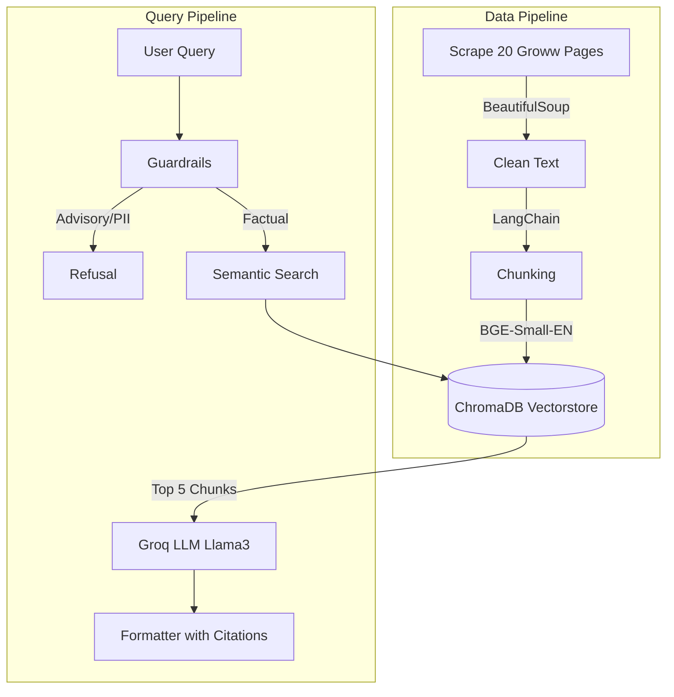

# Mutual Fund FAQ Assistant (RAG Pipeline)

A robust Retrieval-Augmented Generation (RAG) assistant designed to answer factual questions about 20 prominent Indian Mutual Fund schemes. The system scrapes real-time data from Groww, builds a local vectorstore using ChromaDB, and uses Groq (Llama-3) to generate precise, accurate, and guardrailed answers.

## 🌟 Key Features
- **Automated Data Ingestion:** GitHub Actions cron job scrapes and updates embeddings daily.
- **Robust Guardrails:** Strictly blocks PII (PAN, Aadhaar, Phone, Email) and refuses to provide financial advisory or investment recommendations.
- **High Accuracy Retrieval:** Achieved 100% accuracy on a custom 30-query benchmark dataset for scheme detection and guardrail enforcement.
- **Modern Architecture:** FastAPI Python backend powered by LangChain, with a beautiful Next.js frontend.

## 🏗️ Architecture


## 🛠️ Tech Stack
- **Backend**: FastAPI, Python
- **AI/LLM**: LangChain, Groq (Llama-3-70b-8192), HuggingFace (BAAI/bge-small-en-v1.5)
- **Database**: ChromaDB (Vector Store)
- **Frontend**: Next.js, React, TailwindCSS
- **CI/CD**: GitHub Actions (for daily scheduled scraping)

## 🚀 Setup & Execution (Local)

### 1. Backend Setup
1. Clone the repository.
2. Create a virtual environment and install dependencies:
   ```bash
   python3 -m venv venv
   source venv/bin/activate
   pip install -r requirements.txt
   ```
3. Set your Groq API key:
   ```bash
   cp .env.example .env
   # Add your GROQ_API_KEY to .env
   ```
4. Run the data ingestion script (only needed once, as GitHub Actions does this daily):
   ```bash
   python3 scripts/run_ingestion.py
   ```
5. Start the FastAPI backend:
   ```bash
   uvicorn app.api:app --reload
   ```

### 2. Frontend Setup
1. Open a new terminal and navigate to the frontend directory:
   ```bash
   cd frontend
   ```
2. Install Node dependencies:
   ```bash
   npm install
   ```
3. Create a `.env.local` file in the frontend folder:
   ```bash
   NEXT_PUBLIC_API_URL=http://localhost:8000
   ```
4. Start the frontend:
   ```bash
   npm run dev
   ```

## 📊 Covered Mutual Fund Schemes
The bot can answer questions about the following 20 canonical schemes:
* HDFC Defence Fund, HDFC Flexi Cap, HDFC Gold ETF, HDFC Mid Cap, HDFC NIFTY 50, HDFC Silver ETF, HDFC Small Cap
* ICICI Prudential Large Cap, Multi Asset, Silver ETF, Technology
* Motilal Oswal Flexi Cap, Large and Midcap, Midcap, Small Cap
* Parag Parikh Conservative Hybrid, ELSS Tax Saver, Flexi Cap, Large Cap, Liquid Fund

## 🛡️ Example Queries
**Factual (Allowed):**
- *"What is the expense ratio of HDFC Mid Cap?"*
- *"When was the ICICI Tech fund launched?"*

**Advisory (Blocked):**
- *"Should I invest in Parag Parikh Flexi Cap?"* -> **Blocked**
- *"Is HDFC Defence Fund a good investment right now?"* -> **Blocked**

**PII (Blocked):**
- *"Check my portfolio for PAN ABCDE1234F."* -> **Blocked**
